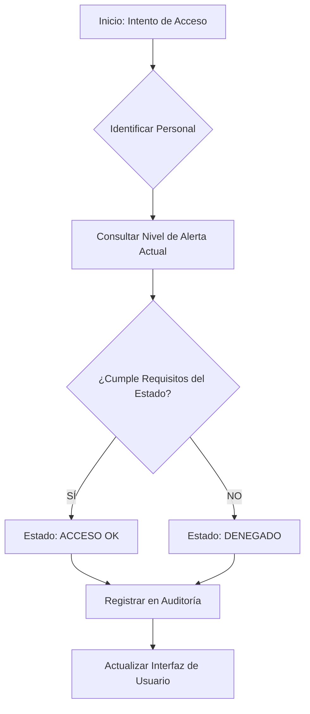

[]
# 🏥 ACCESOMED — Sistema de Control de Acceso Médico

## 📝 1. Descripción del Proyecto
**ACCESOMED** es una plataforma avanzada de gestión de seguridad hospitalaria. El sistema centraliza el control de identidad y permisos de acceso para el personal de salud (Médicos, Enfermeros, Administrativos y Seguridad) basándose en un motor de reglas dinámico que reacciona a los niveles de alerta institucional.

El objetivo principal es garantizar que, en situaciones de crisis o emergencia, solo el personal esencial tenga acceso a zonas críticas, manteniendo un registro auditable de todos los eventos.

---

## 🏗️ 2. Arquitectura y Patrones de Diseño

El sistema sigue principios de ingeniería de software para asegurar la extensibilidad y el bajo acoplamiento. Se han implementado los siguientes patrones de diseño:

### 🧩 Justificación de Patrones
| Patrón | Propósito en ACCESOMED | Justificación Técnica |
| :--- | :--- | :--- |
| **State (Estado)** | Gestión de Niveles de Alerta | El comportamiento de validación de acceso cambia según el estado (NORMAL, PRECAUCIÓN, ALERTA, CRÍTICO). Evita condicionales anidados y encapsula las reglas de restricción en cada estado. |
| **Factory Method** | Creación de Personal | Centraliza la creación de objetos `Medico`, `Enfermero`, `Administrador` y `Seguridad`, permitiendo instanciar perfiles con niveles de acceso base de forma consistente. |
| **Memento** | Puntos de Restauración | Captura el estado completo del sistema en un momento dado, permitiendo revertir cambios o configuraciones de alerta a un punto previo (Puntos de Restauración). |
| **Decorator** | Permisos Temporales | Permite añadir funcionalidades o permisos extra a un objeto de personal existente (ej. elevar nivel o permiso temporal) sin alterar su clase base. |

### 📊 Diagrama de Clases (UML)

### 📊 3. Diagrama de Procesos (Validación de Acceso)

